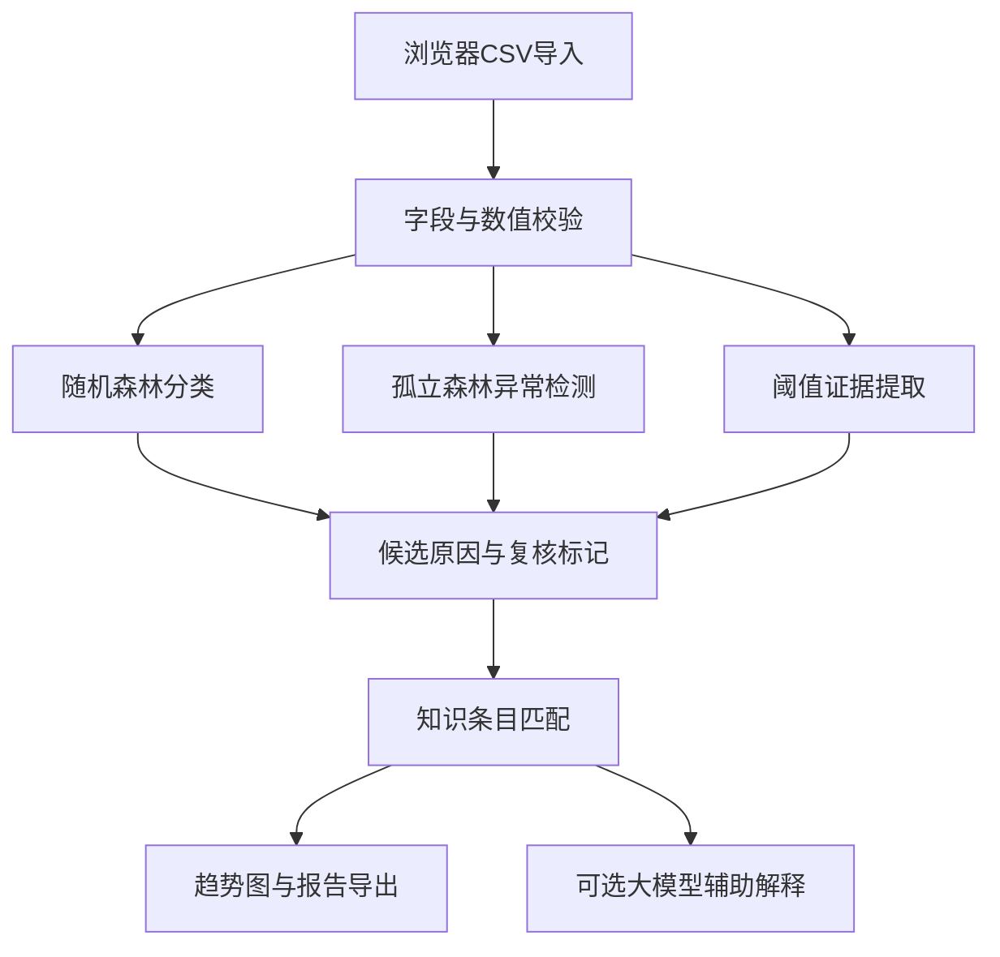

# 软件架构

浏览器提交UTF-8 CSV文本到/api/analyze。后端校验后批量推理，再按记录组合证据。结果存入最多8条的内存缓存，UUID用于本次会话报告索引。浏览器渲染趋势和详情。问答使用/api/chat，由服务端环境变量决定大模型模式。/api/report/{id}导出Markdown。/api/demo提供合成数据，/api/health返回版本。

模块：run.py管理HTTP与缓存；engine.py管理生成、校验、模型及报告；llm.py管理离线说明和API；frontend管理界面。模型启动时重新训练，固定种子便于复现。当前没有数据库、登录或云端数据同步。

开发记录：本次按数据定义、模型实现、HTTP接口、网页、单元测试、浏览器验证、材料草稿顺序完成。实际团队分工未提供，不编造成员或研发周期。团队后续应指定数据核查、算法复现、API接入、演示和提交负责人。
